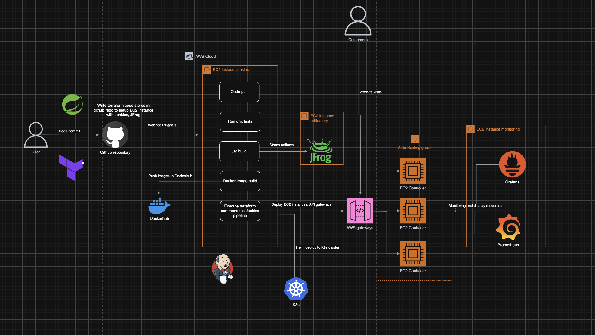

# Spring Boot Application Autoscale with Kubernetes Deployment

This project demonstrates a Spring Boot application designed for deployment on Kubernetes with autoscaling, monitoring, and CI/CD integration.

## Features

- REST API endpoints with custom metrics
- Prometheus metrics exposure via Actuator
- Docker containerization
- Unit and integration tests
- Kubernetes deployment-ready
- Autoscaling compatible

## Architecture diagram


## Prerequisites

- Java 11
- Maven 3.8+
- Docker
- Kubernetes cluster (or Docker Desktop for local testing)
- Helm (for Prometheus/Grafana installation)

## Getting Started

### 1. Clone the repository
```bash
git clone https://github.com/longtran112/springboot-autoscale.git
cd springboot-app
```

### 2. Build the application
```bash
mvn clean package
```

### 3. Run locally
```bash
java -jar target/*.jar
```

### 4. Test endpoints
```bash
# Hello endpoint
curl http://localhost:8080/

# API endpoint
curl http://localhost:8080/api

# Increment custom metric
curl http://localhost:8080/increment

# Health check
curl http://localhost:8080/actuator/health

# Prometheus metrics
curl http://localhost:8080/actuator/prometheus
```

## Running Tests

```bash
# Run all tests
mvn test

# Run specific test class
mvn -Dtest=HelloControllerTest test
```

## Docker Containerization

### Build Docker image
```bash
docker build -t yourusername/springboot-app:latest .
```

### Run Docker container
```bash
docker run -p 8080:8080 yourusername/springboot-app
```

## Kubernetes Deployment

The application is designed to be deployed to Kubernetes using the provided Terraform configuration.

### Key Kubernetes Features:
- Horizontal Pod Autoscaler (HPA)
- Prometheus metrics scraping
- Liveness and readiness probes
- Resource limits and requests

## Configuration

### Environment Variables
| Variable | Default | Description |
|----------|---------|-------------|
| `MANAGEMENT_ENDPOINTS_WEB_EXPOSURE_INCLUDE` | `health,metrics,prometheus` | Actuator endpoints to expose |
| `SERVER_PORT` | `8080` | Application port |

### Prometheus Metrics
The application exposes Prometheus metrics at:
```
http://<pod-ip>:8080/actuator/prometheus
```

To enable custom metrics:
1. Add dependencies in `pom.xml`:
```xml
<dependency>
    <groupId>org.springframework.boot</groupId>
    <artifactId>spring-boot-starter-actuator</artifactId>
</dependency>
<dependency>
    <groupId>io.micrometer</groupId>
    <artifactId>micrometer-registry-prometheus</artifactId>
</dependency>
```

2. Configure in `application.properties`:
```properties
management.endpoints.web.exposure.include=health,metrics,prometheus
management.endpoint.prometheus.enabled=true
management.metrics.export.prometheus.enabled=true
```

## CI/CD Integration

The application is ready for Jenkins CI/CD pipelines with:
- Docker image building
- Push to DockerHub and Artifactory
- Kubernetes deployment

### Jenkins Pipeline Steps:
1. Checkout source code
2. Run tests with `mvn test`
3. Build Docker image
4. Push to DockerHub
5. Push to Artifactory
6. Deploy to Kubernetes cluster


## Monitoring

The application exposes metrics for:
- HTTP request timings
- JVM metrics
- Custom business metrics
- System resource usage

### Grafana Dashboards
1. Spring Boot Statistics: ID 6756
2. JVM Micrometer: ID 4701
3. Kubernetes Cluster Monitoring: ID 3119

## Contributing

1. Fork the repository
2. Create your feature branch (`git checkout -b feature/your-feature`)
3. Commit your changes (`git commit -am 'Add some feature'`)
4. Push to the branch (`git push origin feature/your-feature`)
5. Open a pull request


